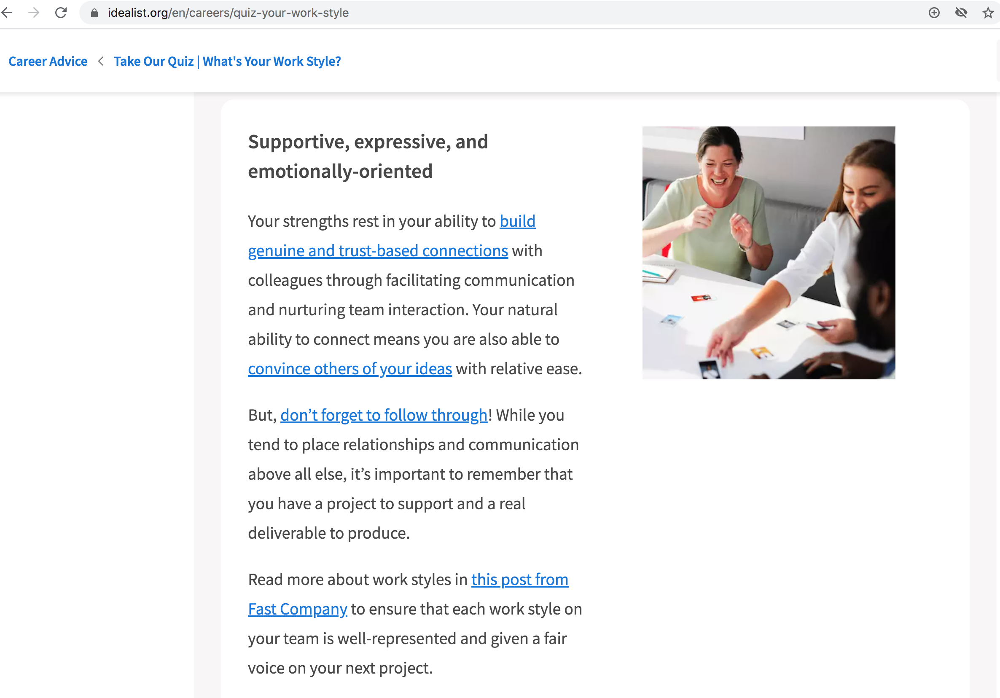

<!DOCTYPE html>
<html>

<body style="background-color:lavender;">

<h1 style="color:MediumOrchid;font-family:futura;">My I.T Profile</h1>
<h3 style="color:MediumOrchid;font-family:arial;">Personal Information:</h3>

Name: Joanna Enstice

Student Number: S387374

Email: s3873742@student.rmit.edu.au

I was born in Australia, but my parents were born in England and moved here in the 1970’s. As a result, I had an English accent till the end of primary school, and people jokingly used to say I sounded like Posh Spice. I love art and have been drawing and painting since I was little. My work has ranged from realistic, to splashes of paint on a canvas, and everything in between. I also really love cars, and currently own a Subaru WRX.  

<h3 style="color:MediumOrchid;">Interest in I.T</h3>

My interest in I.T stemmed from a strong desire to understand how technology works. This began about 7 years ago when I started working on the helpdesk of a software company. I came to enjoy the troubleshooting aspect of it and would often test things in my downtime to fill gaps in my knowledge. I also really enjoyed writing technical guides and documentation on how to perform certain processes, and found it quite rewarding to not only solve problems for clients but teach them new or better ways of doing something using technology. My experience is somewhat limited in that work was more-so related to the software itself rather than the computer or programs running on it, but by proxy I learned a range of skills such as the process of troubleshooting by elimination (which largely comes down to knowing the right questions to ask), the software testing process, knowledge of client-server systems, and the basic concepts of database maintenance and repair. 
I chose RMIT for its long-standing reputation as being a leading technical higher education institution in Australia. The ability to enroll in this subject and Intro to Programming without the need for pre-requisites was great in that I get exposure to a variety of different subjects in the tech industry, thus helping me to decide which area I would like to focus on in future. Their flexibility in terms of online offerings was also a huge plus for me, as it enables me to continue working full time. 
I would expect to have knowledge in most areas of I.T by the end of my studies, and particularly in areas that are set to expand in the coming years, such as cloud based applications and AI. If I went on to do the degree, I would hope that I would have great expertise in one or two key areas that particularly resonated with me, or drew on my existing strengths and likes. 

<h3 style="color:MediumOrchid;">Ideal Job</h3>

<a href="https://www.seek.com.au/job/50543942?type=standout#searchRequestToken=0708ce65-b2a7-4cbc-b39d-913ab137e08d">Software Tester Job Advertisement</a>

This role involves providing testing and quality assurance for a product called HammerTech. I find this position interesting as it would draw on my previous exposure to software testing, and my own love of perfectionism and attention to detail. It requires previous experience in web application testing, working with agile methodology, skills in html/css, experience with agile software development processes, automated test development, and JIRA/BrowserStack tools. It also requires a high level of verbal and written communication skills which would be required to understand the feature requirements expressed by the product managers, and bug reports from customers. I currently already possess the requirements of having excellent verbal and written communication skills, interpersonal skills, and being a self-starter. At this time I don’t possess the other skills and experience they require for the role, other than some experience in software application testing. I would gain the necessary skills and experience by learning how to use the particular programs they had mentioned, perhaps undertaking certificates or courses in these to demonstrate proficiency. I would learn html and css, and perhaps try and work at an entry level for a software company using agile methodologies, to gain some real world experience.

<h3 style="color:MediumOrchid;">Personal Profile</h3>

According to the Myers Briggs Type Indicator for personalities, I am an INFP. You can read more about this type here: <a href="https://www.16personalities.com/infp-personality">Who is INFP?</a>
  
The results of the Meyers Briggs have indicated that I am a quiet, imaginative, kind and creative person, who tries to look for the best in everything in everyone. I would agree with this to some extent, however feel I am more realistic in that good cannot be found in absolutely everything and everyone. I am seemingly dedicated and hard-working, and prefer to seek harmony with others, with no interest in power or leadership. These ideals are reinforced through the results of a Work Style Quiz, the results of which can be seen in the screenshot below. 

Interestingly, I am also a visual learner, as was found by this test <a href="http://www.educationplanner.org/students/self-assessments/learning-styles-quiz.shtml?event=results&A=6&V=10&T=4"</a>here: 

In the context of a team environment, I believe these characteristics mean I’ll be wanting to work harmoniously with others and may find conflict troublesome. This could result in me becoming withdrawn or avoidant in times of disagreement, instead of trying to promote open and effective discussion about the matter. Given I tend to be on the reserved side, when it comes to forming a team I think I should seek out team members who are effective listeners and diplomatic in their approach to ensuring everyone gets to contribute evenly. 

<h3 style="color:MediumOrchid;">Project Idea</h3>
Overview:
My idea involves developing a friend-finding app which would match users with other users based on personality type. The users would then have the option of being placed in ‘communities’ ranging from 2-3 other ‘matched’ users, giving them a hub where they can chat, form plans to meet, nominate in person activities and meetups etc. 
Motivation:
When it comes to forming new connections, dating apps are plentiful, yet platonic friend finding apps are harder to come by. A highly tailored friend finding experience based on the MBTI personality profiles would help bridge the gap in a society that’s becoming increasingly socially disconnected. The app could be built cross platform using Javascript and tools like React Native, NativeScript, Xamarin or Appcelerator.
Description:
Upon opening the app, the user would be prompted to enter some basic biographical information, and would then answer questions referencing the Myers Briggs personality test. Based on those results, they would then be presented with suggested ‘matches’ which they can swipe to ‘match’ with, or swipe to pass, then be presented with the next suggested match, and so on. Users can chat with their matches and also have the option of being placed in ‘communities’ of 2-3 other matched users, where they can form a group chat. The app could partner with various local businesses and market them as ‘safe’ meetup points. Users could attend these places with the reassurance that they could go to a staff member at any point during the meetup if they felt unsafe in any way.

Tools and Technologies:
The app would be built for both IOS and Android using React Native, a development tool which was originally created by Facebook, and is based upon the Javascript language. It would not require any particularly unique or unusual technology, as the code could be written by software developers using desktop PCs, with access to a mobile app test environment.

Skills Required:
A decent working knowledge of Javascript, knowledge of the mobile app development process for IOS and Android, and the distribution process to the app and Play stores. Marketing, advertising, and legal experts would also need to be consulted. 

Outcome:
If the app is successful, a gap in the market for a simple to use, safe, cross-platform platonic friend finding app will be filled. 

</body>
</html>
